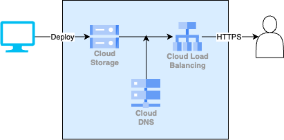

# Day 5: Level 1 ワークショップ — GCS静的サイトホスティング + LB + CDN

## ビジネスシナリオ

> **シチュエーション**: あなたは社内のWeb開発チームに所属しています。マーケティング部門から「来月のキャンペーン用ランディングページを公開したい。WordPressのような動的サーバーは管理が面倒なので、HTML/CSS/JSだけの静的サイトで十分。ただし、CDNを入れてアジアからのアクセスを速くしたい」という依頼が来ました。
>
> **あなたの課題**: GCSで静的サイトをホスティングし、HTTP(S) Load Balancer + Cloud CDNを前段に配置してキャッシュ付きで配信する基盤をTerraformで構築してください。今後のキャンペーンでも同じ構成を一瞬で再現できるようにしたい、というのがIaCで管理する動機です。

## 課題構成図



詳細は [architecture.md](./architecture.md) を参照。

---

## 使用するGCPサービス

| GCPサービス           | 役割                        | AWSでの対応サービス             | 無料枠                             |
| --------------------- | --------------------------- | ------------------------------- | ---------------------------------- |
| Cloud Storage (GCS)   | HTMLファイルのホスティング  | S3 + S3 Static Website Hosting  | 5GB/月（US）。asia利用でも数円     |
| HTTP(S) Load Balancer | トラフィック分散・HTTPS終端 | ALB (Application Load Balancer) | 無料枠なし。**演習後すぐ destroy** |
| Cloud CDN             | エッジキャッシュ            | CloudFront                      | LBに含まれる                       |
| Cloud DNS             | 名前解決                    | Route 53                        | $0.20/ゾーン/月                    |

---

## なぜこの構成なのか

### 「HTMLファイルを置くだけなのに、なぜWebサーバーを立てないのか」

静的サイト（HTML/CSS/JSだけで完結するサイト）のためにNginxやApacheを動かすGCEインスタンスを立てると、24時間稼働のサーバー管理が発生します。OSのパッチ適用、プロセス監視、スケール設定…これらすべてが「HTMLを配信するだけ」という目的に対して過剰です。GCSの静的Webホスティング機能を使えば、ファイルを置くだけで配信が完了し、サーバー管理はゼロになります。

### 「GCSから直接配信できるのに、なぜLBとCDNを前段に置くのか」

GCSのURLを直接公開しても動きますが、実運用では以下の理由でLB + CDNを挟みます:

- **独自ドメイン + HTTPS**: GCSの直接URLは `storage.googleapis.com/バケット名/...` という固定形式で、独自ドメインやSSL証明書を設定できません。LBを前段に置くことで `www.example.com` のようなURLでHTTPS配信が可能になります
- **キャッシュによるレスポンス高速化**: Cloud CDNがユーザーに近いエッジロケーションにコンテンツをキャッシュするため、東京のユーザーはGCSバケットまでリクエストが往復せずに済みます
- **アクセス制御とセキュリティ**: LBにCloud Armorを組み合わせれば、DDoS防御やIPフィルタリングも追加できます（本研修では扱いませんが、実運用では重要です）

### 「HTMLファイルもTerraformで管理するのはやりすぎでは？」

実運用ではHTMLファイルはCI/CDパイプライン（Cloud Build等）でデプロイするのが一般的です。ただし本研修では、Terraform の `google_storage_bucket_object` リソースを体験するために敢えてTerraformで管理しています。「インフラとアプリケーションコードのデプロイを分けるべき」という原則は覚えておいてください。

---

## 要件

1. GCSバケットを作成し、静的Webサイトホスティングを有効化する
2. `index.html` と `404.html` を Terraform で管理する
3. バケットに公開読み取りアクセス（`allUsers`）を設定する
4. Backend Bucket + HTTP(S) LB + Cloud CDN を前段に配置する
5. Cloud DNSゾーンを作成し、LBのIPにAレコードを登録する（ドメインがない場合はIPアクセスでOK）
6. すべてTerraformで構築する

---

## 実装ガイド

完全なサンプルは以下を参照。

- Terraformコード: [examples/terraform/](./examples/terraform/)
- HTMLサンプル: [examples/site/](./examples/site/)

### 実行手順

```bash
cd docs/day05_workshop_level1/examples/terraform

terraform init
terraform plan  -var="project_id=YOUR_PROJECT_ID"
terraform apply -var="project_id=YOUR_PROJECT_ID"

# 出力されたIPにブラウザでアクセス（反映まで5〜10分かかる場合あり）
terraform output website_ip

# 検証が終わったら必ず destroy
terraform destroy -var="project_id=YOUR_PROJECT_ID"
```

### GCP HTTP(S) LB の構成要素

GCPのLBは以下の4つのリソースで構成されます（AWSのALBに相当）:

```
Global Address → Forwarding Rule → Target Proxy → URL Map → Backend (Bucket/Service)
```

| リソース | 役割 |
| --- | --- |
| `google_compute_global_address` | グローバル静的IPアドレス |
| `google_compute_global_forwarding_rule` | IP + ポートを Target Proxy に紐付ける |
| `google_compute_target_http_proxy` | HTTP リクエストを受け取って URL Map に渡す |
| `google_compute_url_map` | URLパスに応じてバックエンドを振り分ける |
| `google_compute_backend_bucket` | GCS バケットをバックエンドとして登録（CDN設定もここ） |

---

## 完了条件チェックリスト

- [ ] `terraform plan` がエラーなく通る
- [ ] `terraform apply` で全リソース作成
- [ ] ブラウザで LB の IP にアクセスし `index.html` が表示される（反映に5〜10分かかる場合あり）
- [ ] 存在しないパスで `404.html` が表示される
- [ ] **`terraform destroy` で全リソース削除**（LBは時間課金のため必須）

---

## 次のステップ

→ [Day 6: コンテナ基礎・Cloud Run](../day06_container/README.md)
