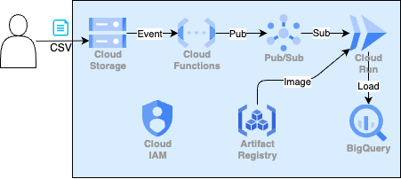

# Level 2 構成図の解説



> 📐 編集可能な原本: [architecture.drawio](./architecture.drawio) — drawioで開いて構成を編集できます（セットアップ手順は [Day 0: 0-5. drawio のセットアップ](../day00_setup/README.md#0-5-drawio-のセットアップ任意推奨)）。

## イベントフロー

```
[店舗A] [店舗B] [店舗C]
     │     │     │
     ▼     ▼     ▼
   ┌────────────────────┐
   │  Raw CSV Bucket    │   <-- gs://PROJECT-raw-csv/
   │  (Cloud Storage)   │
   └────────┬───────────┘
            │ object.finalized イベント
            ▼
   ┌────────────────────┐
   │  Cloud Functions   │   <-- csv-trigger (Gen2, Node.js)
   │  (csv-trigger)     │       CSV以外は無視
   └────────┬───────────┘
            │ publishMessage
            ▼
   ┌────────────────────┐
   │  Pub/Sub Topic     │   <-- csv-uploaded
   │  (csv-uploaded)    │
   └────────┬───────────┘
            │ push subscription (HTTPS)
            ▼
   ┌────────────────────┐
   │  Cloud Run         │   <-- etl-worker:v1
   │  (etl-worker)      │       CSV を pandas 等で加工
   └────────┬───────────┘
            │ INSERT
            ▼
   ┌────────────────────┐
   │  BigQuery          │   <-- pipeline_data.orders
   │  (pipeline_data)   │
   └────────────────────┘
```

## 各コンポーネントの役割

### Raw CSV Bucket

店舗側がアップロードしてくるCSVファイルを受け取るバケット。本研修ではアップロード方法は問わない（コンソール / gsutil / アプリケーションどれでも可）。

### Cloud Functions (csv-trigger)

GCSの `object.finalized` イベント（オブジェクト作成完了）をトリガーに起動。

- CSV以外のファイル拡張子なら何もせず終了
- CSV の場合は `{ bucket, file }` の JSON を Pub/Sub トピックへ publish

ここでは「重い処理はしない」のがポイント。バリデーションも最低限にとどめ、ETLは下流の Cloud Run に任せる。

### Pub/Sub Topic (csv-uploaded)

Cloud Functions と Cloud Run を疎結合にするキュー。Push サブスクリプションで Cloud Run の `/process` エンドポイントに HTTP リクエストとして配信される。

### Cloud Run (etl-worker)

CSV の加工本体。Pub/Sub から渡された `{ bucket, file }` を見て、

1. GCS から CSV をダウンロード
2. パース・正規化・バリデーション
3. BigQuery にロード（streaming insert または load job）

ETL の重さに応じて `--memory` `--cpu` `--max-instances` を調整できる。

### BigQuery (pipeline_data.orders)

加工済みデータの最終的な置き場。Looker Studio から接続すれば即ダッシュボード化できる。

---

## サービスアカウントと最小権限

| サービスアカウント | 付与ロール | 理由 |
| --- | --- | --- |
| `etl-worker-sa` | `roles/bigquery.dataEditor` | BQへのINSERT |
| `etl-worker-sa` | `roles/storage.objectViewer` | GCSからCSV読み取り |
| `pubsub-invoker-sa` | `roles/run.invoker` | Pub/Sub → Cloud Run の OIDC 認証 |

「最小権限の原則」に沿ってサービスアカウントを分離。実運用では Cloud Functions と Cloud Run でも SA を分けるのがベター。

---

## 課金が発生するリソース

| リソース | 課金単位 | 目安 |
| --- | --- | --- |
| Cloud Functions | 呼び出し回数 + GB-s | 数十回なら無料枠内 |
| Pub/Sub | データ量 | 数KB なら無料枠内 |
| Cloud Run | リクエスト + vCPU 秒 | 数回なら無料枠内 |
| Artifact Registry | ストレージ | 500MB まで無料 |
| BigQuery | ストレージ + クエリスキャン量 | 数MB なら無料枠内 |

> 💡 すべて Always Free 枠の範囲で動かせる構成。それでも検証が終わったら `terraform destroy` で片付けるのが鉄則です。
