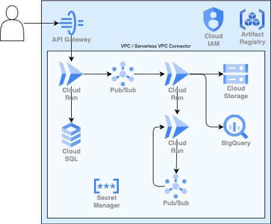

# Level 3 構成図の解説



> 📐 編集可能な原本: [architecture.drawio](./architecture.drawio) — drawioで開いて構成を編集できます（セットアップ手順は [Day 0: 0-5. drawio のセットアップ](../day00_setup/README.md#0-5-drawio-のセットアップ任意推奨)）。

## システム全体フロー

```
[User]
  │
  │ HTTPS
  ▼
[GCP API Gateway]                  ← OpenAPI spec で /orders, /health を定義
  │
  │ x-google-backend (HTTP)
  ▼
[Order Svc (Cloud Run)]
  │
  ├─ INSERT ──────────────────▶ [Cloud SQL (PostgreSQL)] ← VPCコネクタ経由
  │                                     ↑
  │                          [Secret Manager: db-password]
  │
  └─ publish ──▶ [Pub/Sub: orders]
                       │ push subscription
                       ▼
                  [Processing Svc (Cloud Run)]
                       │
                       ├─ write ─▶ [Cloud Storage]
                       ├─ insert ▶ [BigQuery: analytics]
                       │
                       └─ publish ──▶ [Pub/Sub: processed]
                                            │ push subscription
                                            ▼
                                       [Notify Svc (Cloud Run)]
                                            │
                                            └─ log only
```

## 各コンポーネントの役割

### API Gateway 層

- **`google_api_gateway_api`**: APIの論理的な箱
- **`google_api_gateway_api_config`**: OpenAPI spec を保持する不変リソース。変更時は新しい Config を先に作って Gateway を切り替える
- **`google_api_gateway_gateway`**: 実際にHTTPSを受けるエンドポイント。`{gateway-id}-{hash}.{region}.gateway.dev` というドメインが自動付与される

OpenAPI spec の `x-google-backend.address` で Cloud Run の URL を指定する。Terraform では `templatefile()` で動的に埋め込む。

### Order Service

- **責務**: HTTPリクエスト受付 / バリデーション / DB保存 / Pub/Sub publish
- **接続先**: Cloud SQL（プライベートIP / VPC コネクタ経由）、Pub/Sub `orders` トピック
- **特徴**: ユーザーに 202 Accepted を即座に返し、重い処理は後続に委譲

### Processing Service

- **責務**: 注文データの加工 / GCS への保存 / BigQuery への投入 / 完了通知の publish
- **接続先**: GCS、BigQuery、Pub/Sub `processed` トピック
- **特徴**: 一番CPU・メモリを使う。`max_instance_count` をチューニング対象にする

### Notify Service

- **責務**: 通知（メール・SMS・Push 等の送信。本研修ではログ出力で代用）
- **接続先**: Pub/Sub `processed` を subscribe するだけ
- **特徴**: 将来、通知手段を増やしてもこのサービスだけ拡張すればよい

## サービスアカウントと権限マトリクス

| サービスアカウント | 主な権限 |
| --- | --- |
| `api-gateway-sa` | `roles/run.invoker` (Order Svc に対して) |
| `order-svc-sa` | `roles/cloudsql.client`, `roles/secretmanager.secretAccessor`, `roles/pubsub.publisher` |
| `processing-svc-sa` | `roles/storage.objectCreator`, `roles/bigquery.dataEditor`, `roles/pubsub.publisher` |
| `notify-svc-sa` | （実質ログ書き込みのみ） |
| `pubsub-invoker-sa` | `roles/run.invoker` (Processing/Notify Svc に対して) |

**最小権限の原則**: 各サービスは自分が必要とするロールだけを持つ。例えば Order Svc は BigQuery への書き込み権限を持たない（持つ必要がない）。

## 課金注意リソース

| リソース | 課金単位 | 時間あたり目安 |
| --- | --- | --- |
| Cloud SQL (db-f1-micro) | 時間課金 | $0.015 |
| HTTP(S) LB（API Gateway内部） | 時間課金 | $0.025〜 |
| VPCコネクタ (e2-micro × 2) | 時間課金 | $0.014 |
| API Gateway | 従量 | $3 / 100万リクエスト |
| Cloud Run | リクエスト + vCPU秒 | ゼロスケール時 $0 |

**1時間稼働で $0.05〜0.07 程度**。確認後は必ず `terraform destroy` で停止すること。
