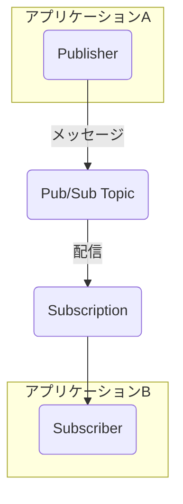

# Day 7: 非同期処理とデータ分析基盤 — Pub/Sub, Cloud Functions, BigQuery

**ゴール**: 同期処理の限界を理解し、データパイプラインを構成する主要なサービス（Pub/Sub, BigQuery）の基本的な役割と操作を習得する。

---

## Day 6までの課題

Day 6で構築したWebアプリケーションは、ユーザーからのリクエストを受け取り、その場で処理を完了させて応答を返す **「同期的」** なものでした。これは、処理がすぐに終わる場合には有効です。

しかし、もし処理に数分かかるタスク（例: 動画のエンコード、大量データを含むレポート生成）だったらどうなるでしょうか？ユーザーは処理が終わるまで、ずっと画面の前で待たなくてはなりません。サーバーもその間リソースを占有され続け、タイムアウトしてしまうかもしれません。

このような「待たせる」問題を解決し、アプリケーション全体の信頼性と拡張性を向上させるのが **「非同期処理」** のアーキテクチャです。Day7では、そのアーキテクチャを支える重要な部品について学びます。

---

## 1. 非同期メッセージングの要: Pub/Sub

非同期処理の核となるのが、**Pub/Sub** のようなメッセージングサービスです。

Pub/Subは、アプリケーション間の「伝言役」や「郵便局」に例えられます。時間がかかる処理の依頼（メッセージ）を、後で処理してくれる別のサービスに直接渡すのではなく、Pub/Subという仲介役に一旦預けます。



| 用語 | 役割 | 例（郵便） |
| :--- | :--- | :--- |
| **Publisher** | メッセージを送る側 | 手紙を出す人 |
| **Topic** | メッセージの宛先（カテゴリ） | 郵便ポスト |
| **Subscription** | メッセージを受け取る購読設定 | 郵便受け（私書箱） |
| **Subscriber** | メッセージを受け取る側 | 手紙を受け取る人 |

#### Pub/Subがもたらすメリット

-   **疎結合**: 送信側（Publisher）は、受信側（Subscriber）が誰で、今動いているかすら知る必要がありません。ただTopicにメッセージを投げるだけです。
-   **流量制御 (バッファリング)**: アクセスが急増しても、メッセージをTopicに一旦溜めることで、後続のサービスが自分のペースで処理できます。
-   **信頼性**: 受信側がメッセージ処理に失敗しても、Pub/Subがメッセージを保持し、成功するまで再配信してくれます。

---

## 2. イベントをトリガーに動く: Cloud Functions

Pub/Subに届いたメッセージを、誰が処理するのでしょうか？そこで登場するのが **Cloud Functions** です。

Cloud Functionsは、「特定の出来事（イベント）」が起きたら、短いコードを自動で実行してくれるサーバーレスな実行環境です。Day8のワークショップでは、このCloud Functionsを使ってPub/Subメッセージを処理するパイプラインを構築します。

---

## 3. 超高速な分析基盤: BigQuery

処理したデータは、どこかに保存して後で分析したいはずです。そのための最適な場所が **BigQuery** です。

BigQueryは、ペタバイト級のデータでも数秒で分析できる、サーバーレスなデータウェアハウスです。使い慣れたSQLで大量のデータをインタラクティブに集計・分析できます。

---

## 4. ハンズオン: 各サービスを個別に触ってみる

Day8のワークショップでこれらのサービスを連携させる前に、まずはそれぞれのサービスが単体でどのように動くのか、Terraformとコマンドラインで体験してみましょう。

サンプルコード: [examples/pubsub-bq/](./examples/pubsub-bq/)

### ステップ1: Pub/Subの動作確認

**目的:** メッセージを送受信する基本を学びます。

**1. Terraformでリソースを作成**
`pubsub.tf` に定義されたTopicとSubscriptionを作成します。
```hcl
# pubsub.tf
resource "google_pubsub_topic" "orders" { ... }
resource "google_pubsub_subscription" "orders_sub" { ... }
```
```bash
terraform init
terraform apply
```

**2. gcloudで動作確認**
Publisherとして振る舞い、Topicにメッセージを送信します。
```bash
gcloud pubsub topics publish orders-topic \
  --message='{"order_id":"ORD-001","customer":"tanaka","amount":1500}'
```
次に、Subscriberとして振る舞い、Subscriptionからメッセージを受信します。
```bash
gcloud pubsub subscriptions pull orders-subscription --auto-ack
```
コンソールに先ほど送信したメッセージが表示されれば成功です。PublisherがTopicにメッセージを投げ、SubscriberがSubscriptionからメッセージを受け取る、という基本の流れを確認できました。

### ステップ2: BigQueryの動作確認

**目的:** データを格納し、SQLでクエリを実行する基本を学びます。

**1. Terraformでリソースを作成**
`bigquery.tf` に定義されたデータセットとテーブルを作成します。
```hcl
# bigquery.tf
resource "google_bigquery_dataset" "training" { ... }
resource "google_bigquery_table" "orders" { ... }
```
*(すでに `terraform apply` 済みの場合は不要です)*

**2. bqコマンドで動作確認**
`bq` コマンドを使い、テーブルに手動でデータを1行挿入します。
```bash
bq query --use_legacy_sql=false \
  "INSERT INTO training_dataset.orders (order_id, customer, amount, status, created_at)
   VALUES ('ORD-002', 'suzuki', 3000, 'received', CURRENT_TIMESTAMP())"
```
次に、`SELECT` クエリで挿入したデータを確認します。
```bash
bq query --use_legacy_sql=false \
  "SELECT * FROM training_dataset.orders WHERE order_id = 'ORD-002'"
```
巨大なデータ分析基盤であるBigQueryも、使い慣れたSQLで簡単に操作できることが分かりました。

---

## 次のステップ

Pub/SubとBigQueryという、データパイプラインの「入口」と「出口」を個別に確認しました。

次のDay8では、いよいよこれらの部品をCloud FunctionsやCloud Runと連携させ、**「GCSにCSVがアップロードされたら、自動でデータがBigQueryに格納される」**という、本格的なETLパイプラインの構築に挑戦します。

→ [Day 8: Level 2 ワークショップ — サーバーレスデータパイプライン](../day08_workshop_level2/README.md)
